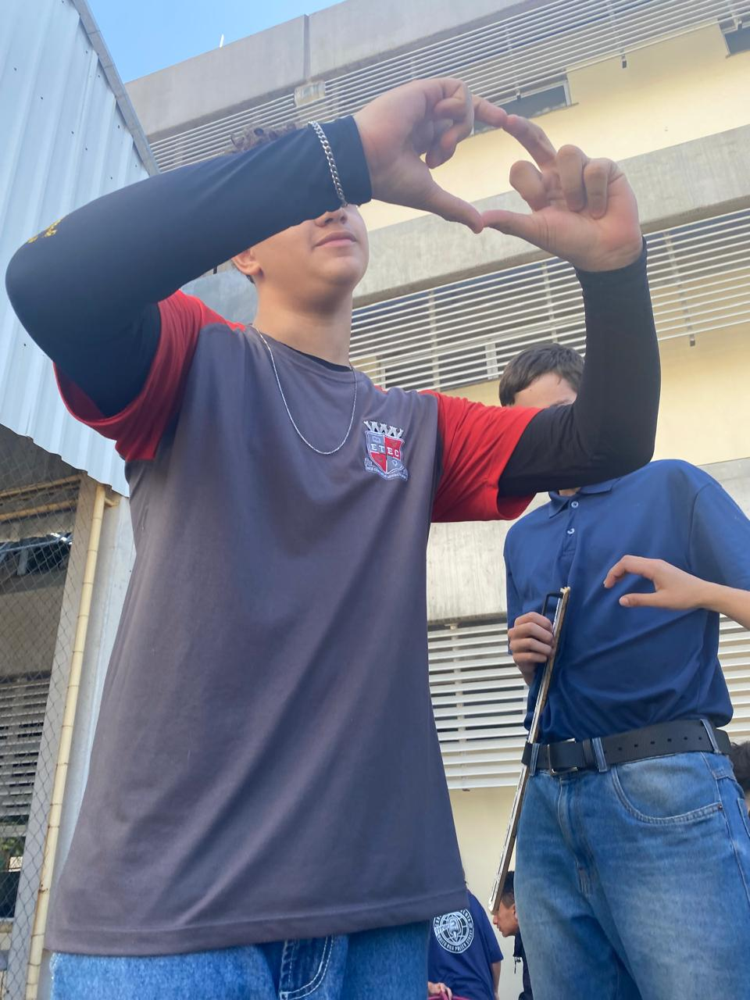
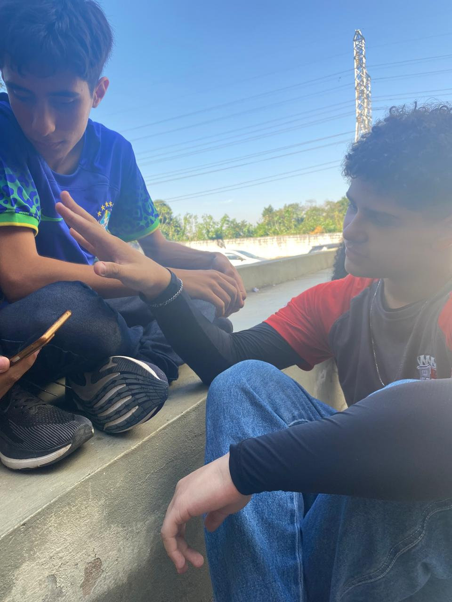

<!DOCTYPE html>
<html lang="pt-BR">
<head>
    <meta charset="UTF-8">
    <meta name="viewport" content="width=device-width, initial-scale=1.0">
    <link rel="stylesheet" href="css.css">
</head>
<body>
    

        <header>
            <h1>João Marquezini (Jão)</h1>
            <nav>
                <ul>
                    <li><a href="https://kauakaw.github.io/friend/inicio.html">Início</a></li>
                    <li><a href="https://jvkij0.github.io/trabalho-do-amigo/amigo.html">Palhaçõ</a></li>
                    <li><a href="https://jvkij0.github.io/trabalho-do-amigo/sala.html">Sala</a></li>
                </ul>
            </nav>
        </header>
            <main>
            

                <table>
                    <tr>
                        <td></td>
                        <td class="texto">
                            João Marquezine é um adolescente de 15 anos que estuda desenvolvimento de sistemas na Etec Ermelinda. Se destaca pelo seu carisma juntamente com senso de humor questionável.
                        </td>
                    </tr>
                     
                     
                     
                     
                    <tr>
                        <td class="space1"></td>
                        <td> João Marqezini se destaca por ser um otimo amigo com diversas qualidades, apesar de seu gosto peculiar e preferencias estranhasa é um amigo que pode ser contado e um otimo ser humano</td>
                        <td class="space2"></td>
                    </tr>
                    <tr>
                        <td>
                            

                                

                                  
                                

                                

                                  
                                

                                

                                  
                                

                              

                                                             
                                                                    
                        </td>
                    </tr>
                </table>
            

            

                <video controls>
                   <source src="Download (1).mp4" type="video/mp4">
               </video>
        </main>
        <footer>
            
© 2024. Todos os direitos reservados.

        </footer>
    

</body>
</html>
